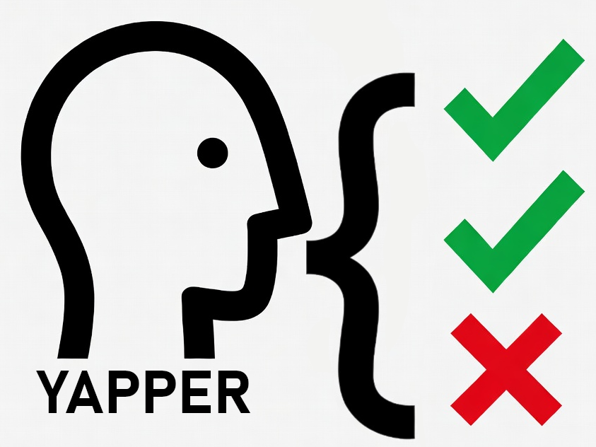

<p align="center">
  
</p>

<h1 align="center">Yapper</h1>

<p align="center">
  A Git-friendly desktop UI for <a href="https://crates.io/crates/yapitest">yapitest</a> API testing
</p>

<p align="center">
  <a href="https://github.com/cd-4/yapper/releases/latest">
    
  </a>
  <a href="https://github.com/cd-4/yapper/actions/workflows/release.yml">
    
  </a>
  
  
  
  =18" />
  <a href="https://github.com/cd-4/yapper/issues">
    
  </a>
</p>

---

## Overview

Yapper is a cross-platform desktop application that provides a visual builder for creating, editing, and running API tests defined in YAML. Tests live as plain files in your repository, making them easy to review, diff, and version alongside your code.

## Features

- **Visual test builder** — compose HTTP request steps without writing YAML by hand
- **YAML-backed** — tests are stored as readable YAML files that diff cleanly in PRs
- **Multi-project support** — open and switch between multiple test directories
- **Config management** — define shared variables, base URLs, and reusable step sets
- **Inline test results** — run tests and see pass/fail with assertion details in the UI
- **Cross-platform** — native binaries for macOS (Universal), Windows, and Linux

## Download

Grab the latest installer for your platform from the [Releases](https://github.com/cd-4/yapper/releases/latest) page.

| Platform | File |
|----------|------|
| macOS (Apple Silicon + Intel) | `.dmg` (Universal) |
| Windows | `.msi` / `.exe` |
| Linux | `.AppImage` / `.deb` |

## Development

### Prerequisites

- [Node.js](https://nodejs.org/) >= 18
- [Rust](https://rustup.rs/) (stable)
- On Linux: `libwebkit2gtk-4.1-dev libappindicator3-dev librsvg2-dev patchelf`

### Setup

```bash
npm install
```

### Run in dev mode

```bash
npm run tauri:dev
```

### Build

```bash
npm run tauri:build
```

Compiled binaries land in `src-tauri/target/release/bundle/`.

## Tech Stack

| Layer | Technology |
|-------|-----------|
| UI | [Svelte 5](https://svelte.dev) + TypeScript |
| Desktop shell | [Tauri 2](https://tauri.app) |
| Test runner | [yapitest](https://crates.io/crates/yapitest) |
| Build tool | [Vite 6](https://vitejs.dev) |
